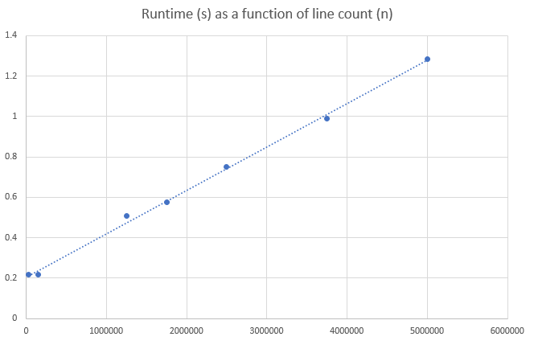

# Word frequency analyzer
Given an input file containing lines of format

´phrase:related_phrase´

finds the 100 most frequently occurring phrases as well as all the related_phrases to the most common one.
Solution is found in linear time, example benchmark done with 64-bit gcc (version 6.3.0) on a i5-2540M processor.

